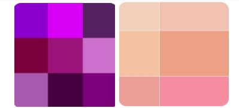
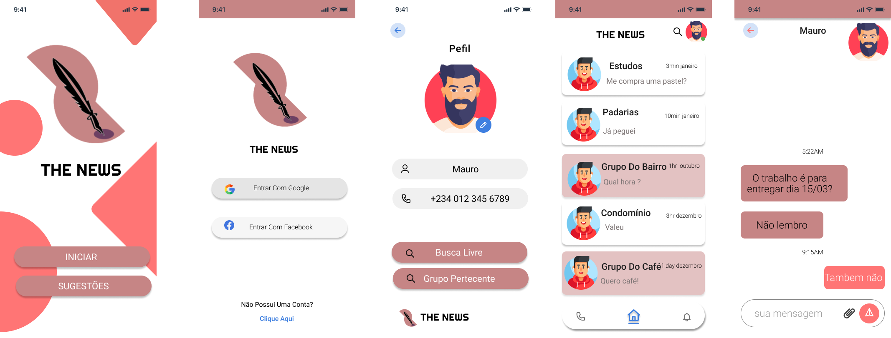

# Projeto de Interface

## Diagrama de Fluxo

Nesta seção, apresentaremos a identidade visual da interface do sistema, por meio do fluxo do usuário e, em seguida, por meio dos wireframes. 

## Wireframes
Neste item, serão apresentadas, com maiores detalhes, as telas da aplicação, o que será feito por meio de tópicos, conforme descrito a seguir. São eles: 

Tela - Apresentação  

Inicialmente, podemos analisar a construção da proposta. Como objetivamos apresentar uma proposta de calmaria e um aspecto, optamos por cores relacionado com a cor purpura e tons de salmão, cor que incentiva a conversa, conforme a psicologia afirma: 

“Além disso, a sensação de calmaria e tranquilidade também estão relacionados com o roxo. Por essa razão, vários temas espirituais e ligados à fé são representados com esta cor.”  

“O roxo ainda representa a imagem do sucesso, da nobreza e da riqueza.” 

significado da cor salmão, além disso, essa tonalidade transmite um senso de abundância e também incentiva a conversa dentro de um espaço. 

A cor salmão está associada à felicidade, por isso muitas pessoas gostam de fazer a decoração no quarto de bebê com os tons de salmão. 

Assim, segue abaixo a demonstração das paletas de cores com base no que esta sendo proposto para a construção do aplicativo. 

 
