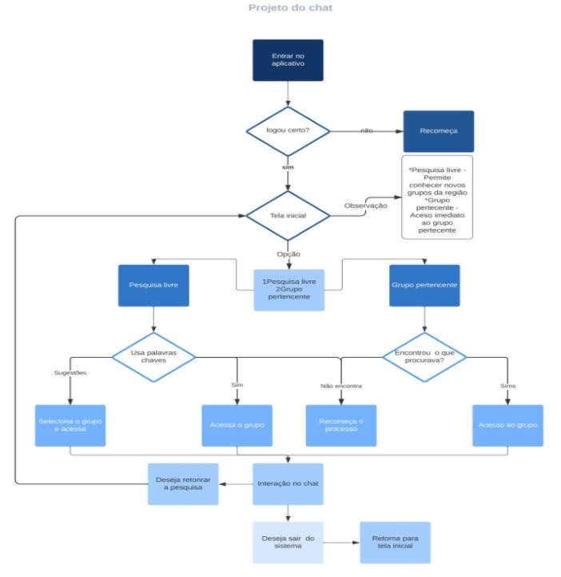

# Projeto de Interface

## Diagrama de Fluxo

Nesta seção, apresentaremos a identidade visual da interface do sistema, por meio do fluxo do usuário e, em seguida, por meio dos wireframes. 

## Wireframes

