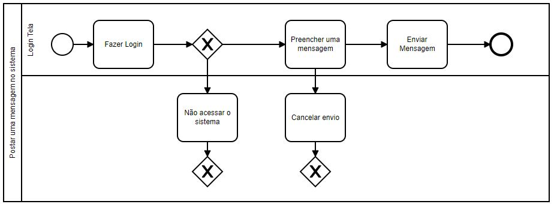
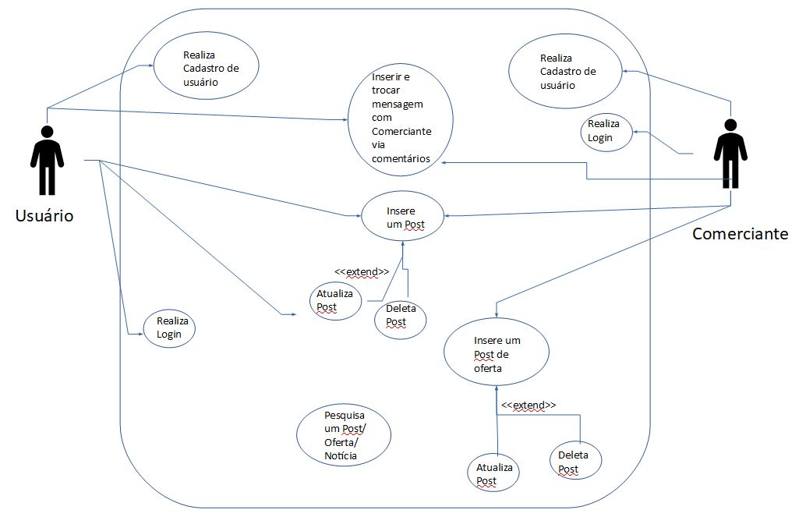
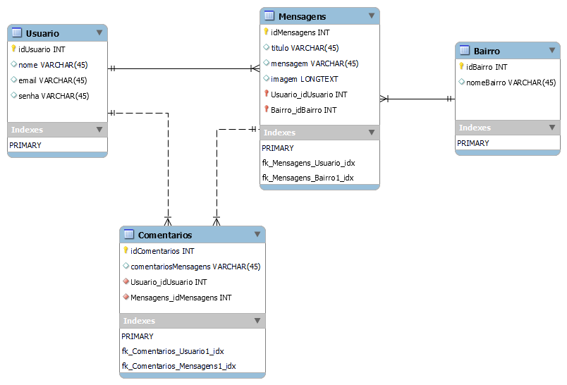

# Arquitetura da Solução

Pré-requisitos: <a href="3-Projeto de Interface.md"> Projeto de Interface</a>

Definição de como o software é estruturado em termos dos componentes que fazem parte da solução e do ambiente de hospedagem da aplicação.

## Diagrama de Classes

O diagrama de classes ilustra graficamente como será a estrutura do software, e como cada uma das classes da sua estrutura estarão interligadas. Essas classes servem de modelo para materializar os objetos que executarão na memória.

As referências abaixo irão auxiliá-lo na geração do artefato “Diagrama de Classes”.

> - [Diagramas de Classes - Documentação da IBM](https://www.ibm.com/docs/pt-br/rational-soft-arch/9.6.1?topic=diagrams-class)
> - [O que é um diagrama de classe UML? | Lucidchart](https://www.lucidchart.com/pages/pt/o-que-e-diagrama-de-classe-uml)

## Modelo ER

O Modelo ER representa através de um diagrama como as entidades (coisas, objetos) se relacionam entre si na aplicação interativa.]

## Esquema Relacional

O desenvolvimento do aplicativo, assim como a ideia inicial, tem como propósito a troca de informações através de mensagens. Com isso em mente, podemos analisar o diagrama a seguir onde, uma pessoa pode logar no sistema criando um usuário. Um usuário pode realizar postagens de muitas mensagens, assim como um usuário também pode realizar vários comentários. Uma mensagem pode ter vários comentários. E por último, um usuário pode ter vários grupos de bairros, assim como um bairro pode receber várias mensagens. Com base nesse diagrama o desenvolvimento da persistência de dados no banco será desenvolvido. 

## Modelo Físico

Entregar um arquivo banco.sql contendo os scripts de criação das tabelas do banco de dados. Este arquivo deverá ser incluído dentro da pasta src\bd.

## Tecnologias Utilizadas

Para a solução do problema, foram utilizadas as tecnologias a seguir:
Serviços web: EXPO e HEROKU
Frameworks: React Native e NODE.js
IDE: VS Code

Descreva aqui qual(is) tecnologias você vai usar para resolver o seu problema, ou seja, implementar a sua solução. Liste todas as tecnologias envolvidas, linguagens a serem utilizadas, serviços web, frameworks, bibliotecas, IDEs de desenvolvimento, e ferramentas.

Apresente também uma figura explicando como as tecnologias estão relacionadas ou como uma interação do usuário com o sistema vai ser conduzida, por onde ela passa até retornar uma resposta ao usuário.

## Hospedagem

O processo de subida para a hospadagem do serciço, foi realizado da seguinte maneira:
Foi criado uma conta no provedor Heroku, criando uma conta básica.
O repositorio do projeto foi enviado através de um push ao seguinte repositorio:
https://github.com/ICEI-PUC-Minas-PMV-ADS/pmv-ads-2022-1-e3-proj-mov-t4-thenews_eixo3
Após o processo de subida dos arquivos ao repositório, voltamos novamente ao Heroku, a realizamos o deploy da aplicação do back-end.
A parte do front-end, o projeto foi mantido na nuvem, pelo site: https://snack.expo.dev/@mateusvg/news
Com o back-end ja feito o deploy, nos chamamos as rotas criadas através da interfaçe Expo.

## Qualidade de Software

A principal norma técnica que podemos citar para a construção do nosso aplicativo, é a PORTABILIDADE. Essa caracteristica refere-se ao software em ser trasferido de um ambiente para o outro. Como se trata de um aplicativo para dispositivos moveis, essa seria a principal caracteristica. Uma segunda caracteristica que nosso aplicativo visa atender é a UBSABILIDADE, onde é a capacidade ou esforço de usar o software. Podemos alencar como sub-caracteristicas a atratividade, onde foi fundamental a escolha da paleta de cores e a simplicidade para o manuseio das telas representado pela operatividade. A funcionalidade, refere-se a existência de um conjunto de funções que satisfaz a necessidade estabelecidas e suas propriedades especificas. Com isso em mente, a funcionalidade seguirá uma linha com base na elicitação dos requisitos, e caso haja a necessidade de mudança de algum requisito tanto funcional, quanto não-funcional, tembém será tomado como base esse novo requisito, para uma acurácia e adequação da funcionalidade do aplicativo.

