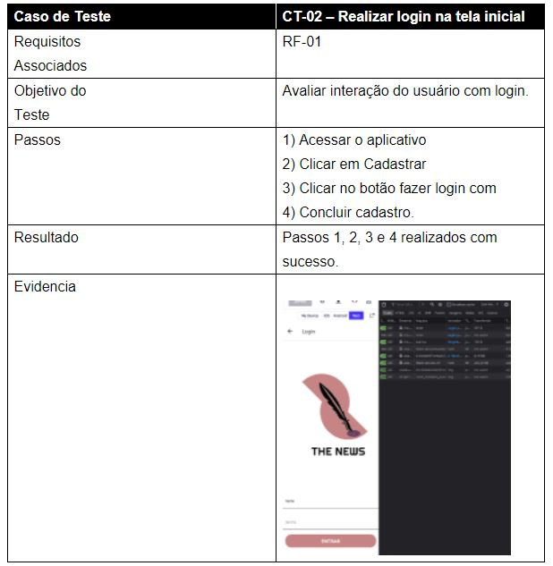
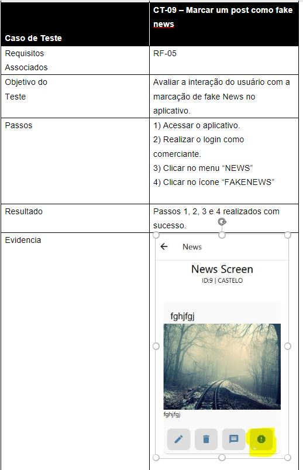

# Registro de Testes de Software

Pré-requisitos: <a href="3-Projeto de Interface.md"> Projeto de Interface</a>, <a href="8-Plano de Testes de Software.md"> Plano de Testes de Software</a>

## Avaliação

Discorra sobre os resultados do teste. Ressaltando pontos fortes e fracos identificados na solução. Comente como o grupo pretende atacar esses pontos nas próximas iterações. Apresente as falhas detectadas e as melhorias geradas a partir dos resultados obtidos nos testes.

